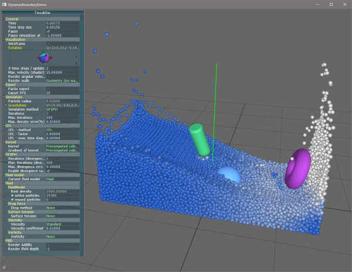

 

SPlisHSPlasH is an open-source library for the physically-based simulation of fluids. The simulation in this library is based on the Smoothed Particle Hydrodynamics (SPH) method which is a popular meshless Lagrangian approach to simulate complex fluid effects. The SPH formalism allows an efficient computation of a certain quantity of a fluid particle by considering only a finite set of neighboring particles. One of the most important research topics in the field of SPH methods is the simulation of incompressible fluids. SPlisHSPlasH implements current state-of-the-art pressure solvers (WCSPH, PCISPH, PBF, IISPH, DFSPH) to simulate incompressibility. Moreover, the library provides different methods to simulate viscosity and surface tension. 

The library uses the following external libraries: [Eigen](http://eigen.tuxfamily.org/), [json](https://github.com/nlohmann/json/), [partio](https://github.com/wdas/partio/), [zlib](https://github.com/madler/zlib), [glew](http://glew.sourceforge.net/) and [AntTweakBar](http://anttweakbar.sourceforge.net/) (only for the demos). All external dependencies are included. 

Furthermore we use our own libraries:
- [PositionBasedDynamics](https://github.com/InteractiveComputerGraphics/PositionBasedDynamics/) to simulate dynamic rigid bodies
- [CompactNSearch](https://github.com/InteractiveComputerGraphics/CompactNSearch) to perform the neighborhood search 

**Author**: [Jan Bender](http://www.interactive-graphics.de), **License**: MIT

## Build Instructions

This project is based on [CMake](https://cmake.org/). Simply generate project, Makefiles, etc. using [CMake](https://cmake.org/) and compile the project with the compiler of your choice. The code was tested with the following configurations:
- Windows 10 64-bit, CMake 3.5.2, Visual Studio 2015
- Ubuntu 16.10 64-bit, CMake 3.5.2, GCC 6.2.0.

Note: Please use a 64-bit target on a 64-bit operating system. 32-bit builds on a 64-bit OS are not supported.

## Pressure Solvers

The SPlisHSPlasH library implements the following pressure solvers: 

* Weakly compressible SPH for free surface flows (WCSPH)
* Predictive-corrective incompressible SPH (PCISPH)
* Position based fluids (PBF)
* Implicit incompressible SPH (IISPH)
* Divergence-free smoothed particle hydrodynamics (DFSPH)

## Viscosity

* Standard SPH formulation of viscosity
* XSPH

## Surface Tension

The SPlisHSPlasH library implements the surface tension methods of the following publications: 

* Markus Becker and Matthias Teschner. Weakly compressible SPH for free surface flows. In Proceedings of ACM SIGGRAPH/Eurographics Symposium on Computer Animation, 2007. Eurographics Association.

* Nadir Akinci, Gizem Akinci, and Matthias Teschner. Versatile surface tension and adhesion for SPH fluids. ACM Trans. Graph., 32(6):182:1–182:8, 2013. 
 
* Xiaowei He, Huamin Wang, Fengjun Zhang, Hongan Wang, Guoping Wang, and Kun Zhou. Robust simulation of sparsely sampled thin features in SPH-based free surface flows. ACM Trans. Graph., 34(1):7:1–7:9, 2014.

## Documentation

The API documentation can be found here: 

http://www.interactive-graphics.de/SPlisHSPlasH/doc/html

## Screenshots
		
	

## Videos

Divergence-Free Smoothed Particle Hydrodynamics:

Divergence-Free SPH for Incompressible and Viscous Fluids:

## References

* Nadir Akinci, Gizem Akinci, and Matthias Teschner. Versatile surface tension and adhesion for SPH fluids. ACM Trans. Graph., 32(6):182:1–182:8, 2013. 

* Markus Becker and Matthias Teschner. Weakly compressible SPH for free surface flows. In Proceedings of ACM SIGGRAPH/Eurographics Symposium on Computer Animation, 2007. Eurographics Association.

* Jan Bender and Dan Koschier. Divergence-free smoothed particle hydrodynamics. In Proceedings of ACM SIGGRAPH / Eurographics Symposium on Computer Animation, 2015. ACM.

* Jan Bender and Dan Koschier. Divergence-free SPH for incompressible and viscous fluids. IEEE Transactions on Visualization and Computer Graphics, 2016.

* Jan Bender, Matthias Müller, Miguel A. Otaduy, Matthias Teschner, and Miles Macklin. A survey on position-based simulation methods in computer graphics. Computer Graphics Forum, 33(6):228–251, 2014.

* Jan Bender, Matthias Müller, and Miles Macklin. Position-based simulation methods in computer graphics. In EUROGRAPHICS 2015 Tutorials. Eurographics Association, 2015.

* Xiaowei He, Huamin Wang, Fengjun Zhang, Hongan Wang, Guoping Wang, and Kun Zhou. Robust simulation of sparsely sampled thin features in SPH-based free surface flows. ACM Trans. Graph., 34(1):7:1–7:9, December 2014. 

* Markus Ihmsen, Jens Cornelis, Barbara Solenthaler, Christopher Horvath, and Matthias Teschner. Implicit incompressible SPH. IEEE Transactions on Visualization and Computer Graphics, 20(3):426–435, March 2014.

* Markus Ihmsen, Jens Orthmann, Barbara Solenthaler, Andreas Kolb, and Matthias Teschner. SPH Fluids in Computer Graphics. In Eurographics 2014 - State of the Art Reports. The Eurographics Association, 2014. 

* Miles Macklin and Matthias Müller. Position based fluids. ACM Trans. Graph., 32(4):104:1–104:12, July 2013.

* Hagit Schechter and Robert Bridson. Ghost sph for animating water. ACM Trans. Graph., 31(4):61:1–61:8, July 2012. 

* B. Solenthaler and R. Pajarola. Predictive-corrective incompressible SPH. ACM Trans. Graph., 28(3):40:1–40:6, July 2009. 