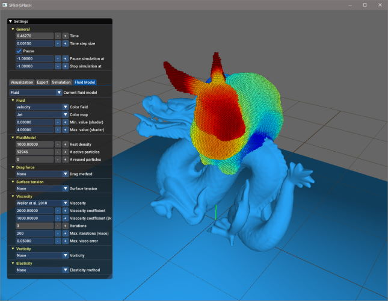

 

&nbsp;&nbsp; 

SPlisHSPlasH is an open-source library for the physically-based simulation of fluids. The simulation in this library is based on the Smoothed Particle Hydrodynamics (SPH) method which is a popular meshless Lagrangian approach to simulate complex fluid effects. The SPH formalism allows an efficient computation of a certain quantity of a fluid particle by considering only a finite set of neighboring particles. One of the most important research topics in the field of SPH methods is the simulation of incompressible fluids. SPlisHSPlasH implements current state-of-the-art pressure solvers (WCSPH, PCISPH, PBF, IISPH, DFSPH, PF) to simulate incompressibility. Moreover, the library provides different methods to simulate viscosity, surface tension and vorticity. 

The library uses the following external libraries: [Eigen](http://eigen.tuxfamily.org/), [json](https://github.com/nlohmann/json/), [partio](https://github.com/wdas/partio/), [zlib](https://github.com/madler/zlib), [cxxopts](https://github.com/jarro2783/cxxopts), [tinyexpr](https://github.com/codeplea/tinyexpr), [toojpeg](https://github.com/stbrumme/toojpeg), [glew](http://glew.sourceforge.net/) and [AntTweakBar](http://anttweakbar.sourceforge.net/) (only for the demos). All external dependencies are included. 

Furthermore we use our own libraries:
- [PositionBasedDynamics](https://github.com/InteractiveComputerGraphics/PositionBasedDynamics/) to simulate dynamic rigid bodies
- [Discregrid](https://github.com/InteractiveComputerGraphics/Discregrid) to detect collisions between rigid bodies
- [CompactNSearch](https://github.com/InteractiveComputerGraphics/CompactNSearch) to perform the neighborhood search 
- [cuNSearch](https://github.com/InteractiveComputerGraphics/cuNSearch) to perform the neighborhood search on the GPU
- [GenericParameters](https://github.com/InteractiveComputerGraphics/GenericParameters) to handle generic parameters

SPlisHSPlasH can export the particle data in the partio format. If you want to import partio files in Maya, try out our Maya plugin: 
- [MayaPartioTools](https://github.com/InteractiveComputerGraphics/MayaPartioTools)

**Author**: [Jan Bender](http://www.interactive-graphics.de), **License**: MIT

## Build Instructions

This project is based on [CMake](https://cmake.org/). Simply generate project, Makefiles, etc. using [CMake](https://cmake.org/) and compile the project with a compiler of your choice that supports C++11. The code was tested with the following configurations:
- Windows 10 64-bit, CMake 3.11.2, Visual Studio 2017
- Debian 9 64-bit, CMake 3.12.3, GCC 6.3.0.

Note: Please use a 64-bit target on a 64-bit operating system. 32-bit builds on a 64-bit OS are not supported.

## Documentation

* [Getting started](doc/getting_started.md)
* [Scene file format](doc/file_format.md)
* [SPH tutorial](https://interactivecomputergraphics.github.io/SPH-Tutorial)
* The API documentation can be found here: http://www.interactive-graphics.de/SPlisHSPlasH/doc/html

## Features

SPlisHSPlasH implements:
* an open-source SPH fluid simulation (2D & 3D)
* several implicit pressure solvers (WCSPH, PCISPH, PBF, IISPH, DFSPH, PF)
* neighborhood search on CPU or GPU
* explicit and implicit viscosity methods
* current surface tension approaches
* different vorticity methods
* computation of drag forces
* support for multi-phase simulations
* simulation of deformable solids 
* rigid-fluid coupling with static and dynamic bodies
* two-way coupling with deformable solids
* fluid emitters
* scripted animation fields
* a json-based scene file importer
* automatic surface sampling
* a tool for volume sampling of closed geometries
* partio file export of all particle data
* VTK file export of all particle data (enables the data import in ParaView)
* rigid body export
* a Maya plugin to model and generate scene files 

## Pressure Solvers

The SPlisHSPlasH library implements the following pressure solvers: 

* Weakly compressible SPH for free surface flows (WCSPH)
* Predictive-corrective incompressible SPH (PCISPH)
* Position based fluids (PBF)
* Implicit incompressible SPH (IISPH)
* Divergence-free smoothed particle hydrodynamics (DFSPH)
* Projective Fluids (PF)

## Boundary Handling 

The SPlisHSPlasH library implements the following boundary handling methods:

* Nadir Akinci, Markus Ihmsen, Gizem Akinci, Barbara Solenthaler, and Matthias Teschner, "Versatile rigid-fluid coupling for incompressible SPH", ACM Transactions on Graphics 31(4), 2012

* Dan Koschier and Jan Bender, "Density Maps for Improved SPH Boundary Handling", In Proceedings of ACM SIGGRAPH / EUROGRAPHICS Symposium on Computer Animation (SCA), 2017

* Jan Bender, Tassilo Kugelstadt, Marcel Weiler, Dan Koschier, "Volume Maps: An Implicit Boundary Representation for SPH", ACM SIGGRAPH Conference on Motion, Interaction and Games, 2019

## Viscosity

The SPlisHSPlasH library implements explicit viscosity methods:

* Standard SPH formulation of viscosity
* XSPH

and the implicit methods of the following publications:  

* Jan Bender and Dan Koschier, "Divergence-free SPH for incompressible and viscous fluids", IEEE Transactions on Visualization and Computer Graphics, 2017

* Andreas Peer, Markus Ihmsen, Jens Cornelis, and Matthias Teschner, "An Implicit Viscosity Formulation for SPH Fluids", ACM Transactions on Graphics, 34(4), 2015

* Andreas Peer and Matthias Teschner. Prescribed Velocity Gradients for Highly Viscous SPH Fluids with Vorticity Diffusion. IEEE Transactions on Visualization and Computer Graphics, 2016

* An improved version of: Tetsuya Takahashi, Yoshinori Dobashi, Issei Fujishiro, Tomoyuki Nishita, and Ming C. Lin. Implicit Formulation for SPH-based Viscous Fluids. Computer Graphics Forum, 34, 2015.

* Marcel Weiler, Dan Koschier, Magnus Brand and Jan Bender. A Physically Consistent Implicit Viscosity Solver for SPH Fluids. Computer Graphics Forum (Eurographics), 37(2), 2018

## Surface Tension

The SPlisHSPlasH library implements the surface tension methods of the following publications: 

* Markus Becker and Matthias Teschner. Weakly compressible SPH for free surface flows. In Proceedings of ACM SIGGRAPH/Eurographics Symposium on Computer Animation, 2007. Eurographics Association.

* Nadir Akinci, Gizem Akinci, and Matthias Teschner. Versatile surface tension and adhesion for SPH fluids. ACM Trans. Graph., 32(6):182:1–182:8, 2013. 
 
* Xiaowei He, Huamin Wang, Fengjun Zhang, Hongan Wang, Guoping Wang, and Kun Zhou, "Robust simulation of sparsely sampled thin features in SPH-based free surface flows", ACM Transactions on Graphics, 34(1), 2014.

## Vorticity

The SPlisHSPlasH library implements the vorticity methods of the following publications: 

* Jan Bender, Dan Koschier, Tassilo Kugelstadt and Marcel Weiler. A Micropolar Material Model for Turbulent SPH Fluids. In Proceedings of ACM SIGGRAPH / EUROGRAPHICS Symposium on Computer Animation, 2017

* Miles Macklin and Matthias Müller. Position based fluids. ACM Trans. Graph., 32(4):104:1–104:12, July 2013.

## Drag Forces

The SPlisHSPlasH library implements the drag force computation of the following publications: 

* Christoph Gissler, Stefan Band, Andreas Peer, Markus Ihmsen and Matthias Teschner. Approximate Air-Fluid Interactions for SPH. In Proceedings of Virtual Reality Interactions and Physical Simulations, 2017

* Miles Macklin, Matthias Müller, Nuttapong Chentanez and Tae-Yong Kim. Unified Particle Physics for Real-Time Applications. ACM Trans. Graph., 33(4), 2014

## Elastic Forces

* M. Becker, M. Ihmsen, and M. Teschner. Corotated SPH for deformable solids. Proceedings of Eurographics Conference on Natural Phenomena, 2009

* A. Peer, C. Gissler, S. Band, and M. Teschner. An Implicit SPH Formulation for Incompressible Linearly Elastic Solids. Computer Graphics Forum, 2017

## Multi-Phase Fluid Simulation

The SPlisHSPlasH library implements the following publication to realize multi-phase simulations: 

* B. Solenthaler and R. Pajarola. Density Contrast SPH Interfaces. In Proceedings of ACM SIGGRAPH/Eurographics Symposium on Computer Animation, 2008.

## Screenshots
		
|||
|--|--|
|||

## Videos

The following videos were generated using the SPlisHSPlasH library:

*A Micropolar Material Model for Turbulent SPH Fluids* | *Density Maps for Improved SPH Boundary Handling*
:---:|:---:
 | 
*Divergence-Free Smoothed Particle Hydrodynamics* | *Divergence-Free SPH for Incompressible and Viscous Fluids*
 | 
*A Physically Consistent Implicit Viscosity Solver for SPH Fluids* | *Turbulent Micropolar SPH Fluids with Foam*
 | 
*Volume Maps: An Implicit Boundary Representation for SPH* | 
 | 

## References

* Nadir Akinci, Gizem Akinci, and Matthias Teschner. Versatile surface tension and adhesion for SPH fluids. ACM Trans. Graph., 32(6):182:1–182:8, 2013. 

* Nadir Akinci, Markus Ihmsen, Gizem Akinci, Barbara Solenthaler, and Matthias Teschner, "Versatile rigid-fluid coupling for incompressible SPH", ACM Transactions on Graphics 31(4), 2012

* Markus Becker and Matthias Teschner. Weakly compressible SPH for free surface flows. In Proceedings of ACM SIGGRAPH/Eurographics Symposium on Computer Animation, 2007. Eurographics Association.

* M. Becker, M. Ihmsen, and M. Teschner. Corotated SPH for deformable solids. Proceedings of Eurographics Conference on Natural Phenomena, 2009

* Jan Bender and Dan Koschier. Divergence-free smoothed particle hydrodynamics. In Proceedings of ACM SIGGRAPH / Eurographics Symposium on Computer Animation, 2015. ACM.

* Jan Bender and Dan Koschier. Divergence-free SPH for incompressible and viscous fluids. IEEE Transactions on Visualization and Computer Graphics, 2017.

* Jan Bender, Dan Koschier, Tassilo Kugelstadt and Marcel Weiler. A Micropolar Material Model for Turbulent SPH Fluids. In Proceedings of ACM SIGGRAPH / EUROGRAPHICS Symposium on Computer Animation, 2017

* Jan Bender, Tassilo Kugelstadt, Marcel Weiler, Dan Koschier, "Volume Maps: An Implicit Boundary Representation for SPH", ACM SIGGRAPH Conference on Motion, Interaction and Games, 2019

* Jan Bender, Matthias Müller, Miguel A. Otaduy, Matthias Teschner, and Miles Macklin. A survey on position-based simulation methods in computer graphics. Computer Graphics Forum, 33(6):228–251, 2014.

* Jan Bender, Matthias Müller, and Miles Macklin. Position-based simulation methods in computer graphics. In EUROGRAPHICS 2015 Tutorials. Eurographics Association, 2015.

* Christoph Gissler, Stefan Band, Andreas Peer, Markus Ihmsen and Matthias Teschner. Approximate Air-Fluid Interactions for SPH. In Proceedings of Virtual Reality Interactions and Physical Simulations, 2017

* Xiaowei He, Huamin Wang, Fengjun Zhang, Hongan Wang, Guoping Wang, and Kun Zhou. Robust simulation of sparsely sampled thin features in SPH-based free surface flows. ACM Trans. Graph., 34(1):7:1–7:9, December 2014. 

* Markus Ihmsen, Jens Cornelis, Barbara Solenthaler, Christopher Horvath, and Matthias Teschner. Implicit incompressible SPH. IEEE Transactions on Visualization and Computer Graphics, 20(3):426–435, March 2014.

* Markus Ihmsen, Jens Orthmann, Barbara Solenthaler, Andreas Kolb, and Matthias Teschner. SPH Fluids in Computer Graphics. In Eurographics 2014 - State of the Art Reports. The Eurographics Association, 2014. 

* Dan Koschier and Jan Bender, "Density Maps for Improved SPH Boundary Handling", In Proceedings of ACM SIGGRAPH / EUROGRAPHICS Symposium on Computer Animation (SCA), 2017

* Miles Macklin and Matthias Müller. Position based fluids. ACM Trans. Graph., 32(4):104:1–104:12, July 2013.

* Miles Macklin, Matthias Müller, Nuttapong Chentanez and Tae-Yong Kim. Unified Particle Physics for Real-Time Applications. ACM Trans. Graph., 33(4), 2014

* A. Peer, C. Gissler, S. Band, and M. Teschner. An Implicit SPH Formulation for Incompressible Linearly Elastic Solids. Computer Graphics Forum, 2017

* Andreas Peer, Markus Ihmsen, Jens Cornelis, and Matthias Teschner. An Implicit Viscosity Formulation for SPH Fluids. ACM Trans. Graph., 34(4), 2015.

* Andreas Peer and Matthias Teschner. Prescribed Velocity Gradients for Highly Viscous SPH Fluids with Vorticity Diffusion. IEEE Transactions on Visualization and Computer Graphics, 2016.

* Hagit Schechter and Robert Bridson. Ghost sph for animating water. ACM Trans. Graph., 31(4):61:1–61:8, July 2012. 

* B. Solenthaler and R. Pajarola. Density Contrast SPH Interfaces. In Proceedings of ACM SIGGRAPH/Eurographics Symposium on Computer Animation, 2008.

* B. Solenthaler and R. Pajarola. Predictive-corrective incompressible SPH. ACM Trans. Graph., 28(3):40:1–40:6, July 2009. 

* Tetsuya Takahashi, Yoshinori Dobashi, Issei Fujishiro, Tomoyuki Nishita, and Ming C. Lin. Implicit Formulation for SPH-based Viscous Fluids. Computer Graphics Forum, 34, 2015.

* Marcel Weiler, Dan Koschier and Jan Bender. Projective Fluids. Proceedings of the 9th International Conference on Motion in Games, ACM, 2016, 79-84

* Marcel Weiler, Dan Koschier, Magnus Brand and Jan Bender. A Physically Consistent Implicit Viscosity Solver for SPH Fluids. Computer Graphics Forum (Eurographics), 37(2), 2018
